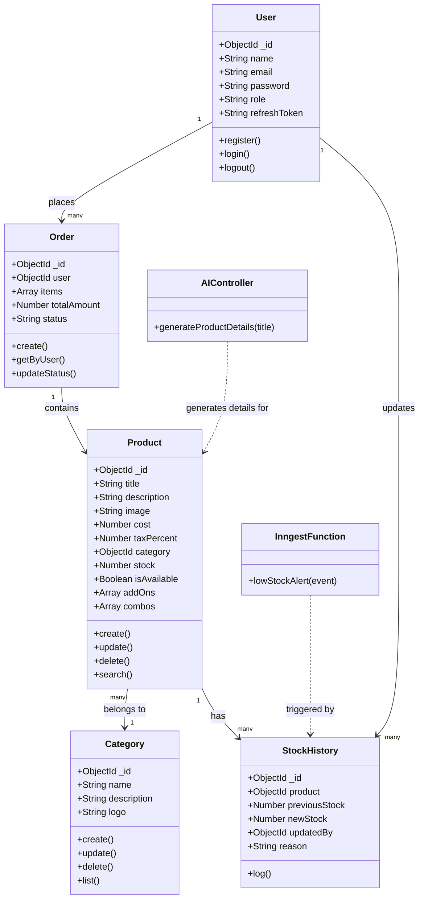

# Retail Portal — Low-Level Design (LLD) Document
> **project_spec.md** · Generated for agentic AI coding assistants (Cursor / Aider)

---

## Table of Contents
1. [Project Overview & MVP Features](#1-project-overview--mvp-features)
2. [Tech Stack & Strict Rules](#2-tech-stack--strict-rules)
3. [AI Agent Coding Constraints](#3-ai-agent-coding-constraints)
4. [Folder Structure](#4-folder-structure)
5. [Database Schema](#5-database-schema)
6. [API Contract](#6-api-contract)
7. [Frontend Component Tree](#7-frontend-component-tree)
8. [System Diagrams (Mermaid.js)](#8-system-diagrams-mermaidjs)

---

## 1. Project Overview & MVP Features

### Summary
A full-stack, single-page e-commerce application (similar to a food/retail portal like KFC's web ordering UI) with a **Customer** side for browsing and ordering, and an **Admin** side for managing products, categories, and stock. The codebase is intentionally kept **flat and simple** so any MERN developer can read it in one sitting.

### Core MVP Features
- **Auth** — Sign-up / Login with JWT (access token in cookie, refresh token in cookie)
- **Role-Based Access** — `admin` and `customer` roles enforced on every protected route
- **Category Management (Admin)** — Create / Edit / List categories with logo upload
- **Product Management (Admin)** — Create / Edit products with image, price, tax %, stock
- **Stock Management (Admin)** — Inline stock update UI with history log
- **Home Page** — Products grouped by category, lazy-load "Load More" per category section
- **Search** — Fuzzy search across product name and category
- **Cart & Orders** — Add to cart, checkout, view order history, re-order shortcut
- **Product Combos / Add-ons** — Products can have optional add-on items and combo bundles


## 2. Tech Stack & Strict Rules

### Backend
| Concern | Library / Tool |
|---|---|
| Runtime | Node.js (v18+) |
| Framework | Express.js |
| Database | MongoDB Atlas via Mongoose |
| Auth | `jsonwebtoken` — access token (15 min) + refresh token (7 days), both in `httpOnly` cookies |
| File Uploads | Multer (memory storage) → Cloudinary SDK |
| AI | LangChain JS (`@langchain/google-genai`) |
| Background Jobs | Inngest (`inngest` npm package, local dev server) |
| Validation | `express-validator` |
| Password Hash | `bcryptjs` |
| Environment | `dotenv` |
| Dev Server | `nodemon` |

### Frontend
| Concern | Library / Tool |
|---|---|
| Framework | React 18 (Vite + JSX) |
| Routing | `react-router-dom` v6 |
| State | Zustand (one store per domain: auth, cart, product) |
| Styling | Tailwind CSS v3 |
| HTTP Client | `axios` (with a shared instance that sends cookies) |
| Icons | `lucide-react` |
| Notifications | `react-hot-toast` |

### Strict Library Rules
- **No Redux, no React Query, no Context API** — Zustand only for shared state.
- **No TypeScript** — plain JavaScript + JSX only.
- **No CSS-in-JS** — Tailwind utility classes only.
- **No custom Express middleware frameworks** — write middleware as plain functions.
- **Axios instance** must have `withCredentials: true` and `baseURL` from `.env`.

### Required `.env` Variables

#### `/server/.env`
```
PORT=5000
MONGO_URI=mongodb+srv://<user>:<pass>@cluster.mongodb.net/retailportal
JWT_ACCESS_SECRET=your_access_secret_here
JWT_REFRESH_SECRET=your_refresh_secret_here
CLOUDINARY_CLOUD_NAME=your_cloud_name
CLOUDINARY_API_KEY=your_api_key
CLOUDINARY_API_SECRET=your_api_secret
GEMINI_API_KEY=your_gemini_api_key
INNGEST_EVENT_KEY=local          # use "local" for dev without a real key
CLIENT_URL=http://localhost:5173
NODE_ENV=development
```

#### `/client/.env`
```
VITE_API_BASE_URL=http://localhost:5000/api
```

---


## 4. Folder Structure

```
retail-portal/
├── client/                          # React frontend (Vite)
│   ├── public/
│   ├── src/
│   │   ├── api/
│   │   │   └── axiosInstance.js     # Shared axios instance with baseURL + withCredentials
│   │   ├── components/              # Reusable UI components
│   │   │   ├── Navbar.jsx
│   │   │   ├── Footer.jsx
│   │   │   ├── ProductCard.jsx
│   │   │   ├── CategoryCard.jsx
│   │   │   ├── CartItem.jsx
│   │   │   ├── Breadcrumb.jsx
│   │   │   ├── SearchBar.jsx
│   │   │   ├── LoadMoreButton.jsx
│   │   │   ├── Spinner.jsx
│   │   │   └── ProtectedRoute.jsx   # Redirects unauthenticated users
│   │   ├── pages/
│   │   │   ├── auth/
│   │   │   │   ├── LoginPage.jsx
│   │   │   │   └── RegisterPage.jsx
│   │   │   ├── admin/
│   │   │   │   ├── AdminDashboard.jsx
│   │   │   │   ├── ManageProducts.jsx
│   │   │   │   ├── ProductForm.jsx  # Create + Edit product form (with AI button)
│   │   │   │   ├── ManageCategories.jsx
│   │   │   │   ├── CategoryForm.jsx
│   │   │   │   └── StockManager.jsx
│   │   │   ├── shop/
│   │   │   │   ├── HomePage.jsx     # Products grouped by category
│   │   │   │   ├── CategoryPage.jsx # Products filtered by one category
│   │   │   │   ├── ProductDetailPage.jsx
│   │   │   │   ├── CartPage.jsx
│   │   │   │   ├── CheckoutPage.jsx
│   │   │   │   └── OrderHistoryPage.jsx
│   │   │   └── NotFoundPage.jsx
│   │   ├── store/                   # Zustand stores
│   │   │   ├── authStore.js         # user, isLoggedIn, login(), logout()
│   │   │   ├── cartStore.js         # items[], addItem(), removeItem(), clearCart()
│   │   │   └── productStore.js      # products[], categories[], fetch actions
│   │   ├── App.jsx                  # Route definitions
│   │   ├── main.jsx
│   │   └── index.css                # Tailwind base imports
│   ├── .env
│   ├── index.html
│   ├── vite.config.js
│   └── package.json
│
└── server/                          # Express backend
    ├── config/
    │   ├── db.js                    # Mongoose connect function
    │   └── cloudinary.js            # Cloudinary SDK config
    ├── models/
    │   ├── User.js
    │   ├── Category.js
    │   ├── Product.js
    │   ├── Order.js
    │   └── StockHistory.js
    ├── controllers/
    │   ├── authController.js        # register, login, logout, refreshToken
    │   ├── categoryController.js    # CRUD for categories
    │   ├── productController.js     # CRUD for products
    │   ├── stockController.js       # updateStock, getStockHistory
    │   ├── orderController.js       # createOrder, getMyOrders, getAllOrders
    │   └── aiController.js          # generateProductDetails (LangChain)
    ├── routes/
    │   ├── authRoutes.js
    │   ├── categoryRoutes.js
    │   ├── productRoutes.js
    │   ├── stockRoutes.js
    │   ├── orderRoutes.js
    │   └── aiRoutes.js
    ├── middleware/
    │   ├── authMiddleware.js        # verifyAccessToken — reads JWT from cookie
    │   ├── roleMiddleware.js        # requireAdmin — checks user.role === 'admin'
    │   └── uploadMiddleware.js      # multer memoryStorage instance
    ├── inngest/
    │   ├── client.js                # Inngest client instance
    │   └── functions/
    │       └── lowStockAlert.js     # Inngest function: fires when stock < threshold
    ├── utils/
    │   └── generateTokens.js        # Creates & sets access + refresh token cookies
    ├── .env
    ├── index.js                     # App entry point, mounts all routes
    └── package.json
```

---

## 5. Database Schema

> All schemas use Mongoose. Comments explain each field.

### `users` collection
```json
{
  "_id": "ObjectId",
  "name": "string",          // User's display name
  "email": "string",         // Unique. Used for login.
  "password": "string",      // bcrypt hashed. Never returned in API responses.
  "role": "string",          // 'customer' or 'admin'. Default: 'customer'
  "refreshToken": "string",  // Stored here to invalidate on logout
  "createdAt": "Date",
  "updatedAt": "Date"
}
```

### `categories` collection
```json
{
  "_id": "ObjectId",
  "name": "string",          // e.g. "Burgers", "Beverages"
  "description": "string",   // Short description shown on UI
  "logo": "string",          // Cloudinary URL for the category logo/icon
  "createdAt": "Date",
  "updatedAt": "Date"
}
```

### `products` collection
```json
{
  "_id": "ObjectId",
  "title": "string",             // Product name, e.g. "Spicy Chicken Burger"
  "description": "string",       // Full product description
  "image": "string",             // Cloudinary URL
  "cost": "number",              // Base price in rupees/currency units
  "taxPercent": "number",        // e.g. 18 for 18% GST
  "category": "ObjectId",        // Ref → Category
  "stock": "number",             // Current stock count
  "isAvailable": "boolean",      // Admin can toggle availability. Default: true
  "addOns": [                    // Optional add-on items (e.g. extra cheese)
    {
      "name": "string",          // e.g. "Extra Cheese"
      "price": "number"          // Additional cost for this add-on
    }
  ],
  "combos": [                    // Other products bundled with this one
    {
      "product": "ObjectId",     // Ref → Product
      "discountPercent": "number" // Discount applied when bought as combo
    }
  ],
  "createdAt": "Date",
  "updatedAt": "Date"
}
```

### `stockhistories` collection
```json
{
  "_id": "ObjectId",
  "product": "ObjectId",      // Ref → Product
  "previousStock": "number",  // Stock value before the update
  "newStock": "number",       // Stock value after the update
  "updatedBy": "ObjectId",    // Ref → User (admin who made the change)
  "reason": "string",         // e.g. "Restocked", "Sold out adjustment"
  "createdAt": "Date"
}
```

### `orders` collection
```json
{
  "_id": "ObjectId",
  "user": "ObjectId",          // Ref → User
  "items": [
    {
      "product": "ObjectId",   // Ref → Product
      "title": "string",       // Snapshot of title at time of order
      "image": "string",       // Snapshot of image URL
      "quantity": "number",
      "priceAtOrder": "number",// Snapshot of cost at time of order
      "selectedAddOns": [      // Which add-ons the user picked
        {
          "name": "string",
          "price": "number"
        }
      ]
    }
  ],
  "totalAmount": "number",     // Final total including tax and add-ons
  "status": "string",          // 'pending', 'confirmed', 'delivered', 'cancelled'
  "createdAt": "Date",
  "updatedAt": "Date"
}
```

---

## 6. API Contract

> Base URL: `/api`
> Auth routes use `httpOnly` cookies. All protected routes require the cookie to be present.

---

### Auth Routes — `/api/auth`

| Method | Endpoint | Role | Request Body | Response |
|---|---|---|---|---|
| POST | `/register` | Public | `{ name, email, password }` | `201 { success, data: { user }, message }` |
| POST | `/login` | Public | `{ email, password }` | `200 { success, data: { user } }` + sets cookies |
| POST | `/logout` | Auth | — | `200 { success, message }` + clears cookies |
| POST | `/refresh-token` | Public (cookie) | — | `200 { success, message }` + new access token cookie |
| GET | `/me` | Auth | — | `200 { success, data: { user } }` |

---

### Category Routes — `/api/categories`

| Method | Endpoint | Role | Request Body / Params | Response |
|---|---|---|---|---|
| GET | `/` | Public | — | `200 { success, data: [categories] }` |
| GET | `/:id` | Public | `id` in URL | `200 { success, data: category }` |
| POST | `/` | Admin | `FormData { name, description, logo (file) }` | `201 { success, data: category }` |
| PUT | `/:id` | Admin | `FormData { name?, description?, logo? }` | `200 { success, data: updatedCategory }` |
| DELETE | `/:id` | Admin | `id` in URL | `200 { success, message }` |

---

### Product Routes — `/api/products`

| Method | Endpoint | Role | Request Body / Query | Response |
|---|---|---|---|---|
| GET | `/` | Public | `?category=id&search=text&page=1&limit=10` | `200 { success, data: { products, total, page } }` |
| GET | `/:id` | Public | `id` in URL | `200 { success, data: product }` (populated category + combos) |
| POST | `/` | Admin | `FormData { title, description, cost, taxPercent, category, stock, image, addOns (JSON string), combos (JSON string) }` | `201 { success, data: product }` |
| PUT | `/:id` | Admin | `FormData { ...any product fields }` | `200 { success, data: updatedProduct }` |
| DELETE | `/:id` | Admin | `id` in URL | `200 { success, message }` |

---

### Stock Routes — `/api/stock`

| Method | Endpoint | Role | Request Body / Params | Response |
|---|---|---|---|---|
| PUT | `/:productId` | Admin | `{ newStock, reason }` | `200 { success, data: { product, stockHistory } }` |
| GET | `/:productId/history` | Admin | `productId` in URL | `200 { success, data: [stockHistory] }` |

---

### Order Routes — `/api/orders`

| Method | Endpoint | Role | Request Body | Response |
|---|---|---|---|---|
| POST | `/` | Customer | `{ items: [{ productId, quantity, selectedAddOns }] }` | `201 { success, data: order }` |
| GET | `/my-orders` | Customer | — | `200 { success, data: [orders] }` |
| GET | `/` | Admin | — | `200 { success, data: [all orders] }` |
| PUT | `/:id/status` | Admin | `{ status }` | `200 { success, data: updatedOrder }` |

---

### AI Routes — `/api/ai`

| Method | Endpoint | Role | Request Body | Response |
|---|---|---|---|---|
| POST | `/generate-product-details` | Admin | `{ title: "Spicy Chicken Burger" }` | `200 { success, data: { description, taxPercent, suggestedAddOns: [{name, price}] } }` |

---

## 7. Frontend Component Tree

```
App.jsx (React Router)
├── /login                    → LoginPage.jsx
│     └── AuthForm.jsx (shared login/register form logic)
├── /register                 → RegisterPage.jsx
│     └── AuthForm.jsx
│
├── /  (ProtectedRoute — any logged-in user)
│   ├── Navbar.jsx
│   │     └── SearchBar.jsx
│   ├── Footer.jsx
│   └── HomePage.jsx
│         ├── CategoryCard.jsx  (×N — one per category)
│         └── [Category Section] (×N)
│               ├── ProductCard.jsx  (×N)
│               └── LoadMoreButton.jsx
│
├── /category/:id  (ProtectedRoute — customer)
│   ├── Navbar.jsx
│   ├── Breadcrumb.jsx
│   ├── CategoryPage.jsx
│   │     ├── ProductCard.jsx  (×N)
│   │     └── LoadMoreButton.jsx
│   └── Footer.jsx
│
├── /product/:id  (ProtectedRoute — customer)
│   ├── Navbar.jsx
│   ├── Breadcrumb.jsx
│   ├── ProductDetailPage.jsx
│   │     ├── AddOnSelector.jsx       (checkboxes for add-ons)
│   │     ├── ComboSection.jsx        (shows bundled combo products)
│   │     └── AddToCartButton.jsx
│   └── Footer.jsx
│
├── /cart  (ProtectedRoute — customer)
│   ├── Navbar.jsx
│   ├── CartPage.jsx
│   │     ├── CartItem.jsx  (×N — with quantity controls)
│   │     └── OrderSummary.jsx  (subtotal, tax, total)
│   └── Footer.jsx
│
├── /orders  (ProtectedRoute — customer)
│   ├── Navbar.jsx
│   ├── OrderHistoryPage.jsx
│   │     └── OrderCard.jsx  (×N — with "Re-order" button)
│   └── Footer.jsx
│
└── /admin  (ProtectedRoute — admin only)
    ├── AdminDashboard.jsx            (sidebar layout)
    │     ├── [Sidebar Nav links]
    │     └── [Outlet for admin sub-pages]
    ├── /admin/products               → ManageProducts.jsx
    │     ├── ProductTable.jsx        (paginated list)
    │     └── [Link to ProductForm]
    ├── /admin/products/new           → ProductForm.jsx
    │     └── AIGenerateButton.jsx    (calls /api/ai/generate-product-details)
    ├── /admin/products/:id/edit      → ProductForm.jsx  (same form, pre-filled)
    ├── /admin/categories             → ManageCategories.jsx
    │     └── CategoryTable.jsx
    ├── /admin/categories/new         → CategoryForm.jsx
    ├── /admin/categories/:id/edit    → CategoryForm.jsx
    ├── /admin/stock                  → StockManager.jsx
    │     └── StockRow.jsx  (×N — inline stock input + save)
    └── /admin/orders                 → AdminOrders.jsx
          └── OrderRow.jsx  (×N — with status dropdown)
```

### Zustand Store Shape

#### `authStore.js`
```js
{
  user: null,              // { _id, name, email, role } or null
  isLoggedIn: false,
  isLoading: false,
  login: async (email, password) => { ... },
  register: async (name, email, password) => { ... },
  logout: async () => { ... },
  fetchMe: async () => { ... },   // Called on app load to restore session
}
```

#### `cartStore.js`
```js
{
  items: [],               // [{ product, quantity, selectedAddOns }]
  addItem: (product, quantity, selectedAddOns) => { ... },
  removeItem: (productId) => { ... },
  updateQuantity: (productId, quantity) => { ... },
  clearCart: () => { ... },
  getTotal: () => { ... }, // Computed: sum of (cost + addOn prices) * quantity
}
```

#### `productStore.js`
```js
{
  products: [],
  categories: [],
  isLoading: false,
  fetchProducts: async (filters) => { ... },   // { category, search, page }
  fetchCategories: async () => { ... },
  fetchProductById: async (id) => { ... },
}
```

---

## 8. System Diagrams (Mermaid.js)

### Class / Entity Diagram



---

### System Flow Diagram — Core User Journey (Browse → Cart → Order)

```mermaid
flowchart TD
    A([User visits Home Page]) --> B[React: HomePage mounts]
    B --> C[productStore.fetchCategories]
    C --> D[GET /api/categories]
    D --> E[MongoDB: find all categories]
    E --> F[Return categories array]
    F --> G[productStore.fetchProducts per category]
    G --> H[GET /api/products?category=id&limit=4]
    H --> I[MongoDB: find products with pagination]
    I --> J[Return products + total count]
    J --> K[Render CategorySection + ProductCards]

    K --> L{User clicks Load More}
    L --> M[Increment page state]
    M --> N[GET /api/products?category=id&page=2]
    N --> O[Append new products to list]

    K --> P{User clicks Product}
    P --> Q[Navigate to /product/:id]
    Q --> R[GET /api/products/:id]
    R --> S[Return product with populated combos + category]
    S --> T[Render ProductDetailPage]
    T --> U{User selects add-ons + clicks Add to Cart}
    U --> V[cartStore.addItem]
    V --> W[Zustand cart state updated]
    W --> X[Navbar cart badge updates]

    X --> Y{User clicks Checkout}
    Y --> Z[Navigate to /cart]
    Z --> AA[User reviews CartItems + OrderSummary]
    AA --> AB{User confirms order}
    AB --> AC[POST /api/orders with items array]
    AC --> AD{authMiddleware: verify JWT cookie}
    AD -->|Invalid| AE[401 Unauthorized → redirect to login]
    AD -->|Valid| AF[orderController.createOrder]
    AF --> AG[Calculate total, save Order to MongoDB]
    AG --> AH[cartStore.clearCart]
    AH --> AI[Navigate to /orders]
    AI --> AJ[GET /api/orders/my-orders]
    AJ --> AK[Render OrderHistoryPage with past orders]

    style A fill:#4ade80,color:#000
    style AE fill:#f87171,color:#000
    style AK fill:#60a5fa,color:#000
```




*End of LLD — `project_spec.md`*
